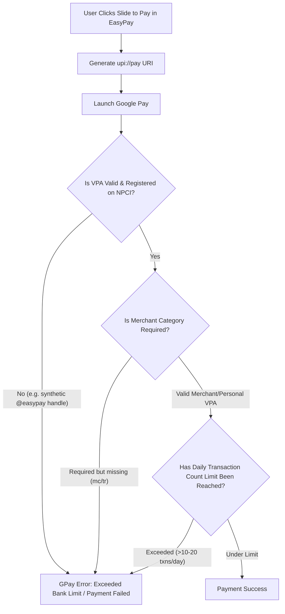

# EasyPay App Architecture & UPI Payment Intent Audit

## 1. Application Overview & Codebase Structure

**Penne Web (EasyPay)** is a mobile-first Progressive Web Application built with React, TypeScript, and Vite. It simulates a digital wallet and payment application leveraging UPI (Unified Payments Interface) deep-linking to execute real monetary transactions via native apps (Google Pay, PhonePe, Paytm).

### Key Directory & File Mapping

```
penne-web/
├── src/
│   ├── main.tsx                # React root entry point
│   ├── App.tsx                 # Screen router & root view renderer
│   ├── data.ts                 # Initial state fixtures & mock profile data
│   ├── types.ts                # TypeScript interfaces (EasyPayState, Payee, Txn, Budget)
│   ├── index.css               # Global baseline CSS & keyframe animations
│   ├── hooks/
│   │   └── useEasyPay.tsx      # Core application hook (state, camera, deep links, handlers)
│   ├── lib/
│   │   ├── upiPay.ts           # UPI deep-link builder (upi://pay) & app trigger
│   │   ├── upiQr.ts            # QR payload parser & VPA validation
│   │   ├── qrImage.ts          # Gallery image QR decoder helper
│   │   ├── appStorage.ts       # LocalStorage state persistence
│   │   ├── style.ts            # Dynamic inline-style generator helper (`css`)
│   │   ├── glyphs.tsx          # SVG glyphs & budget category icons
│   │   └── icons.tsx           # App UI vector icons & brand logos
│   └── screens/
│       ├── Home.tsx            # Main dashboard (balance, actions, recent history)
│       ├── Scanner.tsx         # Camera QR code scanner UI with live reticle
│       ├── ManualUpi.tsx       # Manual VPA/phone number input screen with suggestion chips
│       ├── Amount.tsx          # Keypad amount entry, note, budget picker & slide-to-pay
│       ├── Confirm.tsx         # Payment verification bottom-sheet overlay
│       ├── Receipt.tsx         # Transaction completion receipt & share action
│       ├── History.tsx         # Full transaction log filtering (all/sent/received)
│       ├── Budgets.tsx         # Spending categories & budget progress bars
│       ├── Profile.tsx         # User profile settings & account options
│       ├── Onboarding.tsx      # App intro carousel slides
│       ├── AuthLanding.tsx     # Login / Signup landing selector
│       ├── Login.tsx           # Mobile phone login form
│       └── Signup.tsx          # User profile setup form
```

---

## 2. Standard UPI URI Specification Reference

Per NPCI (National Payments Corporation of India) guidelines, standard UPI deep-link URIs use the `upi://pay` scheme formatted as:

`upi://pay?pa=YOUR_UPI_ID&pn=YOUR_NAME&am=AMOUNT&cu=INR&tn=TRANSACTION_NOTE`

### Parameter Specification Table

| Parameter | Mandatory | Description | Example / Format |
| :--- | :--- | :--- | :--- |
| `pa` | **Yes** | Payee Virtual Payment Address (VPA) / UPI ID | `merchant@okaxis`, `9876543210@upi` |
| `pn` | Recommended | Payee Name | `John Doe` |
| `am` | Optional | Amount to be transferred (Decimal string) | `1.00`, `500.50` |
| `cu` | Optional | Currency Code (Default: `INR`) | `INR` |
| `tn` | Optional | Transaction Note / Remark | `Dinner bill`, `Test payment` |
| `mc` | Optional | Merchant Category Code (4 digits) | `5411` |
| `tr` | Optional | Transaction Reference ID | `REF12345678` |
| `mode` | Optional | Payment mode indicator | `02` (QR), `04` (Intent) |

---

## 3. Audit Findings & Applied Code Fixes

### Fix 1: Mandatory VPA Formatting for Manual Phone Entry
* **File**: [useEasyPay.tsx](file:///home/barath/Codes/penne-web/src/hooks/useEasyPay.tsx#L578)
* **Issue**: Entering a raw phone number (e.g. `9876543210`) passed `pa=9876543210` into the deep link. UPI apps require a handle suffix (`@...`) for VPA resolution; bare numbers cause instant intent rejection.
* **Fix**: Updated `onScannedManual()` to auto-append `@upi` (NPCI standard fallback handle) if input is a numeric phone number without `@`.

### Fix 2: Raw Literal `@` in `pa` Parameter
* **File**: [upiPay.ts](file:///home/barath/Codes/penne-web/src/lib/upiPay.ts#L18)
* **Issue**: Standard `URLSearchParams` percent-encodes `@` as `%40` (e.g., `pa=user%40oksbi`). Several Android GPay and PhonePe versions fail to decode `%40` prior to PSP lookup, resolving an invalid VPA and triggering failure alerts.
* **Fix**: Rewrote `buildUpiPayLink()` to manually construct the URI query string, ensuring `pa` retains a literal `@` while all other values (`pn`, `am`, `tn`) are properly `encodeURIComponent`-escaped.

### Fix 3: Payee Name ASCII Sanitization
* **File**: [upiPay.ts](file:///home/barath/Codes/penne-web/src/lib/upiPay.ts#L15)
* **Issue**: Payee names containing non-ASCII symbols or emojis caused intent parsing errors in mobile UPI handlers.
* **Fix**: Stripped non-ASCII characters from `pn` before URI encoding.

---

## 4. Root Cause Analysis: GPay "Exceeded Bank Limit" Error

### Error Description
When initiating a transaction (even for ₹1.00), Google Pay displays:
> *"Your money is not debited. You've exceeded the bank limit for this payment, retry with a smaller amount."*

### Why This Error Happens & Resolution Guide

Although GPay reports a "bank limit" issue, UPI clients frequently mask underlying intent or VPA resolution errors with this generic message. Below are the primary technical causes:



#### 1. Synthetic / Unregistered VPA Handle (Most Common in Test Mode)
* **Cause**: Scanning the in-app "My QR" generates a VPA using `@easypay` (e.g. `9876543210@easypay`). `@easypay` is a simulated handle not registered on the NPCI gateway. When GPay attempts to query the PSP network for `@easypay`, resolution fails and GPay shows the limit error.
* **Fix**: Only test payments using a **real, active UPI VPA** (e.g., your personal GPay/PhonePe VPA such as `yourname@okicici`, `yourname@ybl`, or a real merchant QR).

#### 2. Daily Transaction Count Limit (Not Amount Limit)
* **Cause**: Most Indian banks (SBI, HDFC, ICICI, Axis) impose a **hard limit of 10 to 20 UPI transactions per 24-hour window**, regardless of amount. If you have done multiple test transactions today, even a ₹1 payment will be rejected by your bank under the daily count quota.
* **Fix**: Wait 24 hours or try with an alternate bank account linked in GPay.

#### 3. New UPI Registration / SIM / Device Change Lock
* **Cause**: NPCI guidelines enforce a strict **₹5,000 / 24-hour limit** (and limit count restrictions) for the first 24 hours after re-registering UPI, changing devices, or updating SIM cards.
* **Fix**: Ensure your GPay UPI setup has not been reset within the last 24 hours.

#### 4. Missing Merchant Parameters (`mc`, `tr`, `mode`)
* **Cause**: Paying certain business/merchant VPAs via generic intent URIs without `mc` (Merchant Category Code) or `tr` (Transaction Ref) triggers GPay fraud controls, causing GPay to block the transfer.
* **Fix**: If paying a merchant VPA, scan their official QR code directly rather than manually typing the VPA.
